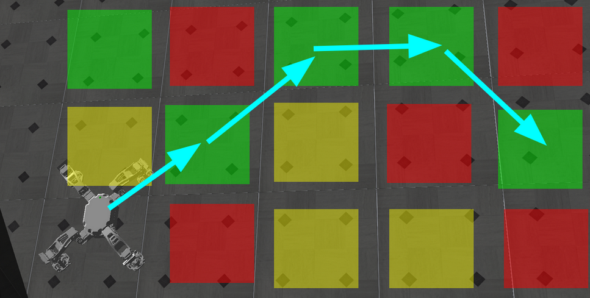
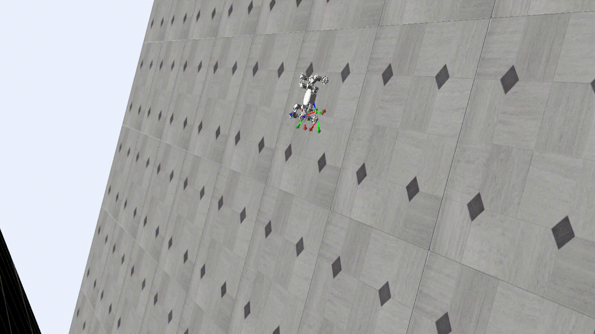
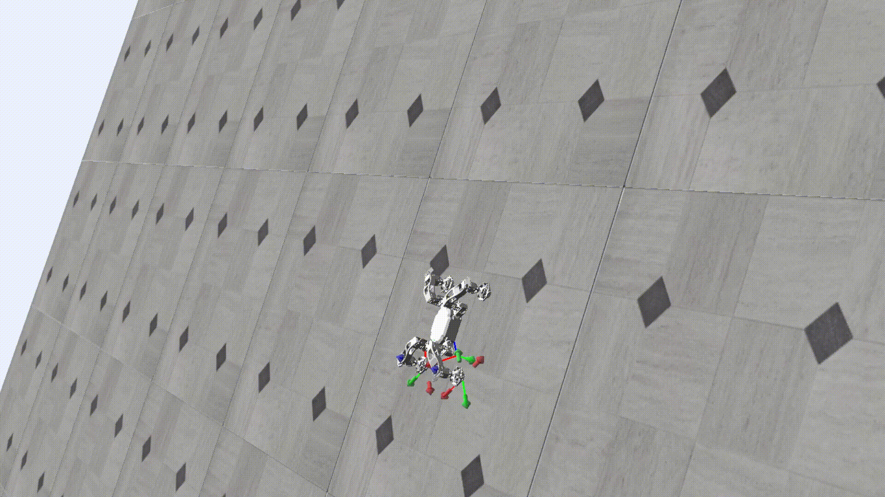

# Reinforcement Learning for Traversal of Uncertain Vertical Terrain using a Magnetic Wall-Climbing Robot


## About
This project aims to give a quadrupedal magnetic-wall-climbing robot the ability to safely navigate a wall with randomly-seeded areas of weakened magnetism (meant to simulate heterogeneous material) to a goal position without falling.  



Falling due to weak magnetism |  Avoiding areas of weak magnetism to reach goal
:-------------------------:|:-------------------------:
  |  

## Contents
```rl/``` contains plugins a custom Gym environment for a Nexxis Magneto wall climbing robot with a ROS-based plugin to interface with an adapted version of the simulation [originally developed by Jee-Eun Lee](https://github.com/jeeeunlee/ros-pnc.git), a simplified game-based simulation for training and visualization purposes, utilities to create maps of magnetic variability, and training and evaluation scripts to learn from both full- and game-based simulations using Deep Q-learning.

Please refer to the [modified version of Jee-Eun's original simulation](https://github.com/steven-swanbeck/magneto-pnc.git) and to the [original project workspace](https://github.com/steven-swanbeck/magneto_rl_basic.git) to see more details of implementation and to use other learning algorithms (namely simple, recurrent, and convolutional implementations of proximal policy optimization) and approaches that were not carried over to this repository.  

---

## Requirements, Dependencies, and Building
These packages are built and tested on a system running ROS1 noetic on Ubuntu 20.04. However, the game simulation and all learning components are pure Python, and can be run independently of ROS or of the dependencies of the full simulation.

### Game Simulation
1. Clone the repository without submodules:
```
git clone git@github.com:steven-swanbeck/magneto_rl.git
```

### Full Simulation
1. Create a Catkin workspace:
```
mkdir -p catkin_ws/src && cd catkin_ws
```
2. Clone the contents of this repository:
```
git clone --recurse-submodules git@github.com:steven-swanbeck/magneto_rl.git src/
```

3. Install all package dependencies:
```
rosdep update
```
```
rosdep install --from-paths src --ignore-src -r -y
```
```
source magneto-pnc/install_sim.sh
```
Please refer to magneto-pnc/notes.txt for helpful installation and troubleshooting tips.

4. Build and source the workspace
```
catkin_make -DCMAKE_BUILD_TYPE=Release
```
```
source devel/setup.bash
```

## Running the Code
To train/test using the full simulation, run

```
roslaunch magneto_rl/base.launch
```
To train or evaluate using only the simple simulation, run
```
python3 train.py
```
or
```
python3 eval.py
```
respectively, from within ```rl/src/```.

---

## Sample Results

### PPO
[](https://github.com/steven-swanbeck/magneto_rl/assets/99771915/e71eb0a7-010a-4f5b-82d1-5deb75673722)

Though it developed the desired goal-pursuing behaviors, the PPO policy often fails to respect and avoid areas of weakened magnetism, causing the robot to take risky paths over dangerous areas that often result in falls or slips.

### DQN
[](https://github.com/steven-swanbeck/magneto_rl/assets/99771915/3e2304db-922f-4e7e-9f5a-aecd7f42712f)

The DQN policy, in contrast, better learned both goal-pursuant and weak-magnetism-avoidant behaviors, helping it safely navigate surfaces with magnetic uncertainty and accomplishing the project objectives. 
 

